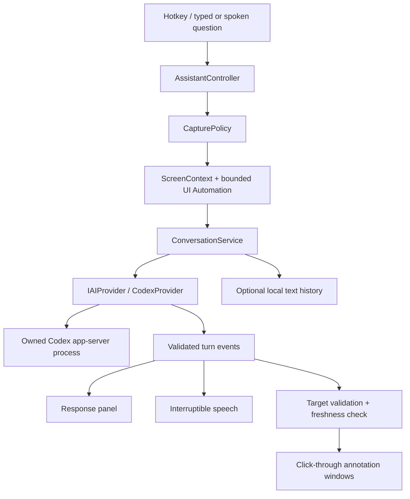

# Little Guy 3000 — proposed architecture

Status: Approved architecture; implementation in progress. This document describes intended behavior, not a claim that every capability has been implemented. Product scope and defaults are in [REFINED_PLAN.md](REFINED_PLAN.md).

## Stack and process boundaries

Use C# and .NET 10 LTS with WinUI 3 on the current stable Windows App SDK. Pin the exact SDK and package versions after a packaged compatibility test. Microsoft currently lists Windows App SDK 2.4.0 as stable; recheck at implementation start. [.NET support policy](https://dotnet.microsoft.com/en-us/platform/support/policy), [Windows App SDK release channels](https://learn.microsoft.com/en-us/windows/apps/windows-app-sdk/release-channels)

Choose a hybrid window architecture: WinUI for the settings and interactive response panel; a small native Win32 window layer for nonactivating, click-through annotations, rendered with Direct2D/DirectComposition if the prototype validates it. Keep graphics interop narrow. Compare a simpler layered-window renderer in the same prototype before taking on native rendering complexity. Do not assume a transparency flag alone guarantees input passthrough; test the actual window/rendering combination against other processes. DirectComposition target ordering is separate from global HWND topmost behavior. WPF is a fallback if the packaged WinUI experience fails concrete focus, accessibility, or windowing tests; Electron is outside the chosen direction. [Layered windows](https://learn.microsoft.com/en-us/windows/win32/winmsg/window-features), [Composition target ordering](https://learn.microsoft.com/en-us/windows/win32/api/dcomp/nf-dcomp-idcompositiondesktopdevice-createtargetforhwnd)

Run as a normal interactive user application. There is no Windows service and no default administrator elevation. Use a supervised UI Automation helper to contain hung third-party accessibility providers. Own a separate Codex child process, linked to application lifetime through Windows process/job management; do not attach to or terminate the user's running Codex app.

| Project | Responsibility |
|---|---|
| `LittleGuy3000.Desktop` | Composition root, tray, onboarding, settings, companion/panel, accessibility, resource branding |
| `LittleGuy3000.Core` | Session state, turn orchestration, walkthroughs, policies, immutable contracts, coordinate transforms |
| `LittleGuy3000.AI` | Provider interfaces, requests/events, response validation and capability descriptions |
| `LittleGuy3000.Codex` | Process supervision, protocol adapter, authentication, model discovery and streaming |
| `LittleGuy3000.ScreenCapture` | WGC, monitor/window snapshots, crop/resize, redaction and buffer lifetime |
| `LittleGuy3000.Overlay` | Native annotation windows, rendering, hit testing, visibility and invalidation |
| `LittleGuy3000.Voice` | Input/output devices, speech recognition/synthesis, bounded speech queue and interruption |
| `LittleGuy3000.Accessibility` | Bounded read-only UI Automation queries and helper process |
| `LittleGuy3000.Persistence` | SQLite, settings, local text history, migrations and deletion |

Create projects when their milestone needs them. Avoid empty future-provider, plugin, or action-execution projects. The solution is `LittleGuy3000.sln`; dependency injection occurs in Desktop. Platform-neutral contracts and geometry remain independently testable.

## Codex boundary

Proposed transport: redirected standard input/output, with stderr handled separately. Bound message sizes, serialize writes, correlate requests, drain output asynchronously, and apply timeouts. Never send raw RPC payloads to logs. Treat unknown notifications compatibly, but fail closed for unknown capability/approval requests.

Use a dedicated application-owned Codex home/configuration and empty working directory, configured only in the child environment. Do not change the user's global Codex configuration or copy credentials. Validate isolation from ambient plugins, instructions, skills, MCP servers, environment secrets, project files, and default tools; a dedicated directory alone is not a security boundary.

Codex owns browser sign-in and token refresh. Prefer its OS credential store with failure reported explicitly, not plaintext fallback. Separate storage should keep Little Guy's logout from disrupting other Codex clients; verify that behavior. [Codex authentication and credential storage](https://learn.chatgpt.com/docs/auth)

The narrow client surface covers initialization, account status/login/logout, usage where available, model discovery, ephemeral thread creation, text/image turns, streamed answer events, and interruption. Generate typed bindings and contract fixtures against the selected installed version. Do not hardcode an account plan, specific model, or claim of unlimited usage.

The local 0.153.4 schema confirms relevant contracts exist, including `thread/start`, `turn/start`, `model/list`, `outputSchema`, `ephemeral`, image URL input, and experimental `thread/realtime/*`. Inspect the corresponding official repository revision and validate actual behavior in Milestone 0. Use capability detection and an explicit supported-version range; an incompatible backend yields a useful error and setup guidance.

Guide-only enforcement must disable built-in execution, filesystem tools, browser/computer use, integrations, and subagents unless explicitly needed and allowed by this product contract. Only answer/annotation operations are eligible. Deny capability escalation. A read-only filesystem sandbox or a prompt saying “do not act” is insufficient. Official configuration exposes tool switches, but their completeness for this version must be tested. [Codex configuration reference](https://learn.chatgpt.com/docs/config-file/config-reference)

On crash: cancel the active generation, stop speech, clear annotations, and reconnect with bounded backoff. Restore approved text context to a new ephemeral session where possible. Do not automatically replay submitted questions or claim an interrupted step completed. A second failure produces a visible retry choice. Restart only processes owned by Little Guy.

## Capture, privacy and retention

`ScreenContextService` creates an immutable snapshot containing a capture ID, UTC and monotonic timestamps, target HWND plus process identity, cursor position, window bounds, monitor topology epoch, per-monitor DPI, capture extent, encoded image dimensions, crop/resize transform, and bounded nearby UIA facts. Process identity must be stronger than an HWND alone because handles can be reused. Infer application version only when reliable.

Resolve and record the target before showing the panel. Check policy before pixels or UIA are collected. Capture a frame on demand, then close the capture session and release GPU/CPU buffers when no longer needed. Exclude Little Guy's own windows where Windows supports it; otherwise hide them for capture and wait for a fresh frame. Validate that the result contains the intended application rather than the assistant or a stale frame. Handle capture-content bounds, HDR-to-SDR conversion, resizing, GPU device loss and a bounded first-frame timeout. GPU initialization may stay warm without maintaining a capture session. [WGC lifecycle and HDR guidance](https://learn.microsoft.com/en-us/windows/apps/develop/media-authoring-processing/screen-capture), [Window-target capture interop](https://learn.microsoft.com/en-us/windows/win32/api/windows.graphics.capture.interop/nf-windows-graphics-capture-interop-igraphicscaptureiteminterop-createforwindow)

Treat secure desktop, lock/sign-in and protected content as unavailable. Capture exclusion is a useful platform feature, not a universal security guarantee. Never change Windows protections to make a capture succeed. [UAC secure desktop](https://learn.microsoft.com/en-us/windows/security/application-security/application-control/user-account-control/how-it-works), [Display-affinity limitations](https://learn.microsoft.com/en-us/windows/win32/api/winuser/nf-winuser-setwindowdisplayaffinity)

No automatic expansion to the whole monitor. Future monitor/region modes must enforce exclusions for every visible blocked window within the scope; refuse the capture when a safe boundary or mask cannot be established. An executable blocklist does not identify individual sensitive browser tabs, so offer a clear screen-off/text-only path and never claim automatic detection of all sensitive content.

Strip password-field values from UIA metadata and mask known sensitive bounds in the AI image. Treat this as best effort; pixels can contain secrets that accessibility metadata cannot identify. Keep a cursor marker in a separate AI-only image copy only if it improves evaluation results without hiding small controls.

Proposed image path: in-memory encoding through an image URL/data payload accepted by the tested backend. **Validate data-URL support and backend handling**; a schema accepting strings does not establish this. Do not use temporary image files as an undisclosed fallback. Use ephemeral Codex conversations, sanitized diagnostics, and no audio/screenshot history. Audit Codex rollouts, attachment caches, temporary directories, speech components, and failure paths using synthetic content before making the retention claim.

The precise promise is “Little Guy does not intentionally save screenshots or recordings.” It is not a guarantee that Windows never pages memory or that a remote provider retains nothing. Onboarding must explain that attached screenshots and context leave the machine for AI processing. Local text history may contain sensitive information derived from the screen even without saved images.

SQLite stores text messages, settings, and text-only walkthrough progress. Protect sensitive text fields with an OS-protected key; SQLite alone is not encryption. History off stops persistence; Delete History covers application-owned messages, summaries, associated journals/backups and active context without touching unrelated Codex data. Account sign-out is separate. Do not promise forensic erasure or deletion of provider-held data.

## Coordinate and grounding contract

Canonical desktop positions are signed physical pixels. Overlay layout uses each monitor's local DIPs; capture and model images use their own pixel spaces. Never apply one global DPI factor to a mixed-DPI desktop. Each snapshot owns invertible transforms for window/capture/image/desktop positions, including crop, resize, origin and any padding. Enable per-monitor DPI awareness before creating windows. Tests cover negative monitor origins and boundaries. Account for DPI-virtualized window rectangles and invisible window borders rather than mixing them with capture bounds. [Windows DPI guidance](https://learn.microsoft.com/en-us/windows/win32/hidpi/high-dpi-desktop-application-development-on-windows), [Window bounds caveats](https://learn.microsoft.com/en-us/windows/win32/api/winuser/nf-winuser-getwindowrect)

An annotation proposal identifies `schemaVersion`, `turnId`, `captureId`, `imageId`, `coordinateSpace`, target label, supported shape, bounds or points, and grounding evidence. Bind trusted window/display identity from the snapshot rather than accepting a model-supplied HWND. Use a bounded JSON schema with finite values, bounded labels, a maximum annotation count, and rejection of unsupported shapes or out-of-range geometry. Never interpret prose as drawing commands.

Prefer a uniquely matched visible UIA control's current bounds. Otherwise use vision evidence tied to the exact model image. A model's numerical confidence is advisory, not a calibrated probability. Ambiguous, hidden, off-screen or stale targets produce clarification or no annotation. Renderer precision and model target accuracy have separate acceptance tests.

UIA work runs on a dedicated MTA thread inside the helper, returning immutable values rather than COM elements. Bound element count, depth and text length; use a proposed 150 ms enrichment deadline and continue with vision when it expires. A process watchdog contains blocked calls that cancellation tokens cannot stop. Do not allow UIA enrichment to delay capture or the response panel. [UIA threading](https://learn.microsoft.com/en-us/windows/win32/winauto/uiauto-threading), [Provider timeout configuration](https://learn.microsoft.com/en-us/windows/win32/api/uiautomationclient/nn-uiautomationclient-iuiautomation2)

Clear annotations on cancellation, step change, target move/resize/minimize, relevant foreground switch, display/DPI change, session lock, expiry, or walkthrough end. Recheck identity and geometry immediately before rendering. Watch local window/accessibility events without background screenshot streaming. Events do not reveal every internal redraw; use short annotation lifetimes and require a fresh observation before renewed guidance. Never simply move an old model estimate onto a changed layout.

## Streaming and interaction

`AssistantController` is an explicit state machine: idle, capturing, listening, submitting, streaming, speaking, guiding, paused, interrupted, error. Streaming and speech can overlap; microphone, response and walkthrough substates must remain consistent. Every event carries a session/turn generation identifier so late events cannot resurrect cancelled content. Pause/lock invalidates that generation, cancels pending capture and unsent uploads, stops recording/playback, and clears guidance. It cannot recall data already sent. Unlocking does not restart listening or uploads.

Keep the annotation window nonactivating and click-through. The interactive panel takes focus only when needed for typing/navigation; it stops following the pointer once open. Speech activation should preserve the target application's keyboard focus where practical.

Prefer streamed answer text plus a separate schema-validated annotation event/tool. If that combination is unreliable, use a structured response envelope with incremental extraction of its answer field; wait for complete validated geometry before rendering. Never speak raw JSON or unvalidated partial labels. Validate this choice during the Codex spike to avoid a second full image request solely to obtain coordinates.

Support push-to-talk release, short tap to type, cancellation and interruption deterministically. RegisterHotKey alone does not define release detection or double taps. Keep any supplementary key tracking limited to configured shortcut keys and never record typing. Registration detects system hotkey conflicts, not every application shortcut conflict; onboarding includes a real shortcut test. Ctrl+Space may conflict with IME/editor behavior, and Alt+Space is a Windows menu shortcut. Region selection must later have an independent shortcut rather than blindly adding Shift to an already assigned combination. [RegisterHotKey](https://learn.microsoft.com/en-us/windows/win32/api/winuser/nf-winuser-registerhotkey), [Low-level hook constraints](https://learn.microsoft.com/en-us/windows/win32/winmsg/lowlevelkeyboardproc)

## Speech and walkthroughs

Keep recognition and synthesis behind separate interfaces. Evaluate local recognition plus installed Windows TTS first, measuring terminology such as “sidechain,” “threshold,” and “NullReferenceException.” Benchmark CPU/RAM, model-download size, languages, licensing and interruption on the intended hardware. A local Whisper-compatible recognizer is a candidate, not a selected dependency. Windows AI recognition and Codex realtime are candidates only after stable API/account availability is verified. Any cloud speech provider requires an explicit decision about data flow and billing.

Do not equate Windows speech APIs with offline dictation: the established Windows free-text recognition path uses Microsoft's online service and requires package identity. The newer Windows AI recognizer's linked API is currently marked experimental. Installed Windows voices provide a synthesis candidate with device-dependent availability and quality. [Windows speech constraints](https://learn.microsoft.com/en-us/windows/apps/develop/input/speech-recognition), [Experimental Windows AI recognition API](https://learn.microsoft.com/en-us/windows/windows-app-sdk/api/winrt/microsoft.windows.ai.speech.speechrecognitionmodel?view=windows-app-sdk-2.0-experimental), [Installed synthesis voices](https://learn.microsoft.com/en-us/uwp/api/windows.media.speechsynthesis.voiceinformation)

`WalkthroughSession` stores objective, current step, completed/skipped/uncertain steps, relevant application, corrections and text summaries. “Done” and “Next” request a fresh allowed observation; completion is verified, uncertain, or corrected. “Back” revisits instructions, not application undo. “Explain” and “Repeat” retain the objective. Support at least 15 steps without a small arbitrary limit; bound context using summaries and discard obsolete image buffers. Restarted sessions resume from text only and need a fresh observation before drawing.

## Packaging and evolution

Test an MSIX package early, including tray lifetime, full-trust child processes, capture, microphone access and update behavior. Finalize a signed distribution/update path before any public release. Keep Codex as an explicit compatible dependency initially; bundling requires a separate review of distribution, update and licensing requirements. Do not use private Codex desktop installation paths as a distribution contract.

Future agent mode is a separately gated capability with per-task scope, target validation, cancellation and clear action previews. Consequential actions need confirmation. Do not expose an undefined “Always allow safe actions” category. User content on screen remains untrusted data and cannot grant permissions. The initial product has no action executor.

## Reply drafting (0.1.3)

The dedicated reply turn schema returns a bounded ReplyBatch with single/multiple/uncertain layout, a focused-composer match flag, and recipient/comment/text records. ReplyDraftPolicy validates current capture identity and lengths before UI use. CodexProvider starts a fresh restricted ephemeral thread for each batch and resets when returning to explanation mode; page content cannot grant tools or execution authority.

MainWindow.Replies orchestrates Ctrl+Shift+R without activating its panel. ReplyComposer reads only the focused UI Automation element on an MTA worker; empty writable Edit/ValuePattern elements must belong to the selected foreground window. It revalidates runtime ID, process, bounds, name, focus, empty value, window lifetime and a three-minute lease immediately before SetValue. It never uses SendInput, clipboard paste, UIA Invoke or SetFocus. If accessibility is unavailable or any check fails, ReplyPadWindow supplies editable copyable drafts. A model's classification can still be wrong; draft insertion is not a send action, and user review remains necessary. Concurrent website DOM changes cannot be made transactional by UI Automation.

The desktop references Microsoft.WindowsDesktop.App.WPF solely for managed UI Automation client assemblies. The interface remains WinUI. Portable publishing includes that desktop runtime. Reply drafts are not persisted or spoken automatically. Tone settings are centralized in UserSettings; existing screen exclusions and cancellation apply.

## Interface overviews (0.1.4)

RegionSelector uses one almost-transparent, input-owning virtual-desktop window, four small click-through yellow edge windows and a hint. Only the edge bitmaps change during drag. It intercepts mouse input rather than simulating clicks; release, Esc, right-click, cancellation and disposal remove the selector. Window resolution happens after teardown at the rectangle center. Captures remain limited to a single app, with existing exclusions.

ScreenCaptureService accepts an optional desktop rectangle. It clips to the chosen window, scales based on the selected region, then applies WinRT cropping with inward-rounded bounds before PNG encoding. The crop-specific ScreenTransform preserves coordinate mapping while WindowContext retains the actual HWND/PID/window bounds for freshness checks. WinRT transform order is scale then crop: https://learn.microsoft.com/en-us/uwp/api/windows.graphics.imaging.bitmaptransform

ExplainInterfaceAsync starts a fresh explanation thread and uses the standard answer schema with a full-interface prompt. Low reasoning remains fast by default, but the 120-word quick-answer restriction is removed. Overview annotations are not rendered. Full-panel follow-ups retain the selected image. Unreadable and uncertain controls must be stated explicitly; the model cannot infer hidden UI as observed fact.

## Local speech replacement (0.1.6)

`LocalSpeechService` records 16 kHz mono PCM into a bounded in-memory buffer with NAudio. Release closes the microphone and awaits local decoding; a 45-second decode timeout and 60-second recording limit bound work. Each recording has its own cancellation source and completion task. Native decoder work is serialized, cancellation suppresses stale transcripts, and asynchronous processor disposal completes before another decoder reuses the model. The model remains loaded for subsequent requests. The service uses the Vulkan runtime when available and the CPU runtime otherwise. It never contacts a transcription endpoint or falls back to Windows dictation/cloud transcription.

Whisper large-v3-turbo is configured for English with a short vocabulary hint containing Spotify and supported app names. Near-silent buffers and high no-speech-probability segments are rejected before commands reach the existing parser. Model output cannot add executable capabilities. The Windows speech synthesis dependency remains only for spoken output and synthetic test recordings.

The portable package includes verified model weights and upstream license notices. `scripts/Install-SpeechModel.ps1` is an explicit developer setup download from the whisper.cpp model repository, pinned by SHA-256. See the [Whisper.net source](https://github.com/sandrohanea/whisper.net) and [whisper.cpp models](https://github.com/ggml-org/whisper.cpp/tree/master/models).
